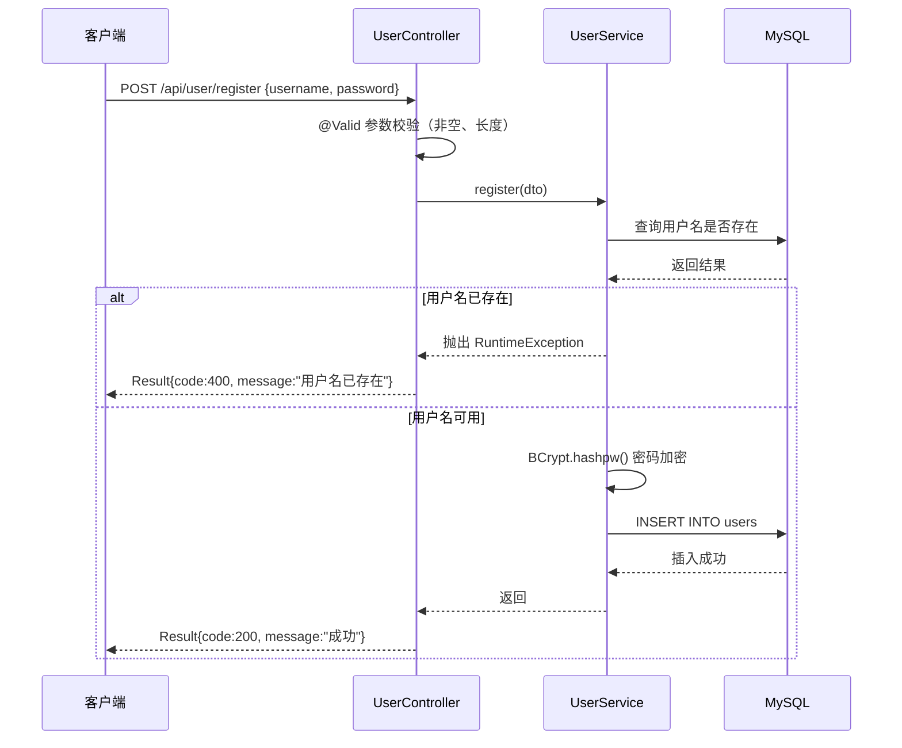
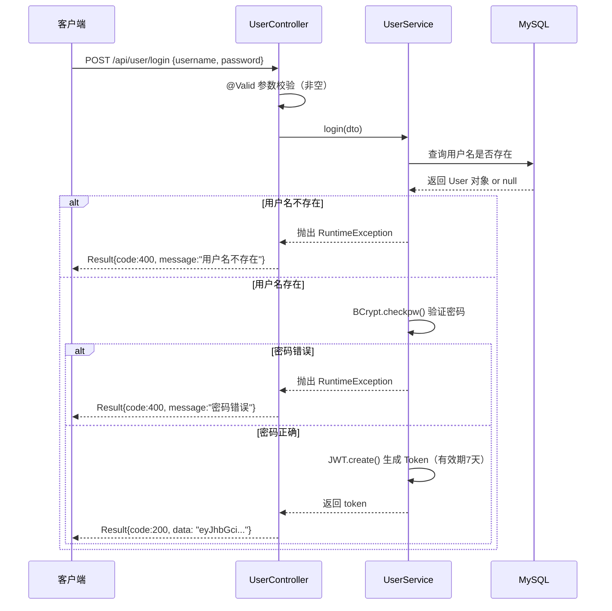
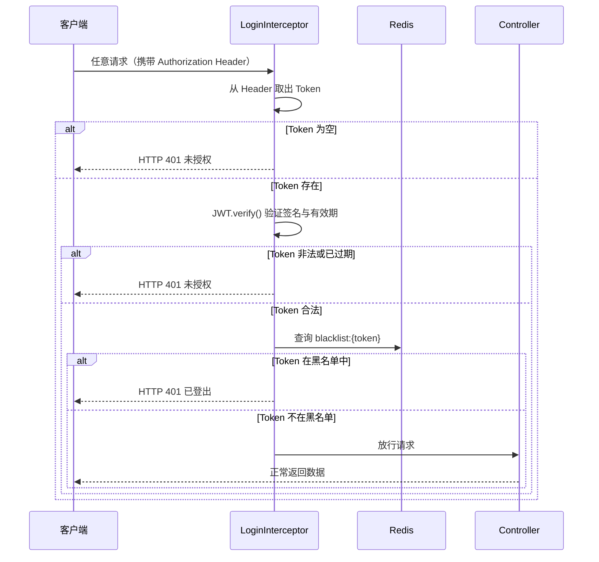
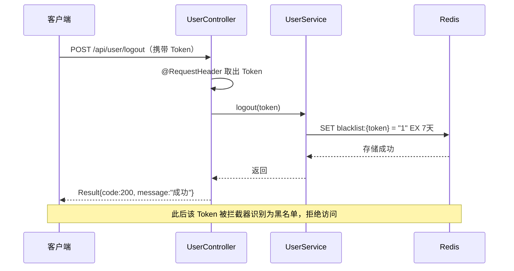

# 码上记 · 程序员知识库平台

> 基于 Spring Boot 3 独立构建的高性能 RESTful API，提供用户注册/登录、JWT 鉴权、Redis 黑名单登出等核心功能。

---

## 目录

- [产品介绍](#产品介绍)
- [技术栈](#技术栈)
- [系统架构图](#系统架构图)
- [时序图](#时序图)
- [数据库设计](#数据库设计)
- [项目亮点](#项目亮点)
- [快速启动](#快速启动)

---

## 产品介绍

**码上记**是一个面向程序员的知识库平台后端系统，提供完整的用户体系、内容管理（文章/分类/标签）以及评论互动功能。

项目采用纯后端 RESTful API 架构，前后端完全分离，接口文档由 Knife4j 自动生成。核心聚焦于以下能力：

- 基于 JWT 的无状态身份认证，保障接口安全
- Redis 黑名单机制，实现安全登出
- MyBatis-Plus 动态查询，简化数据库操作
- Docker 容器化部署，一键启动全套服务

---

## 技术栈

| 类别 | 技术 | 版本     |
|------|------|--------|
| 核心框架 | Spring Boot | 3.5.14 |
| ORM | MyBatis-Plus | 3.5.15 |
| 数据库 | MySQL | 8.0    |
| 缓存 | Redis | 8.2    |
| 身份认证 | JWT（java-jwt） | 4.4.0  |
| 密码加密 | jBCrypt | 0.4    |
| 接口文档 | Knife4j | 5.0.8  |
| 容器化 | Docker + Docker Compose | -      |
| 语言 | Java | 17     |

---

## 系统架构图

```
┌─────────────────────────────────────────────────────────┐
│                        客户端 (前端/Postman)              │
└──────────────────────────┬──────────────────────────────┘
                           │ HTTP 请求（携带 JWT Token）
                           ▼
┌─────────────────────────────────────────────────────────┐
│                    Spring Boot 应用层                     │
│                                                         │
│   ┌─────────────────────────────────────────────────┐   │
│   │              LoginInterceptor（拦截器）           │   │
│   │  1. 检查 Token 是否存在                          │   │
│   │  2. 验证 Token 签名与有效期                      │   │
│   │  3. 查询 Redis 黑名单                            │   │
│   └──────────────────────┬──────────────────────────┘   │
│                          │ 放行                          │
│   ┌──────────────────────▼──────────────────────────┐   │
│   │                  Controller 层                   │   │
│   │         UserController / ArticleController       │   │
│   └──────────────────────┬──────────────────────────┘   │
│                          │                              │
│   ┌──────────────────────▼──────────────────────────┐   │
│   │                  Service 层                      │   │
│   │          业务逻辑 / BCrypt加密 / JWT生成          │   │
│   └──────────┬───────────────────────┬──────────────┘   │
│              │                       │                   │
│   ┌──────────▼──────────┐ ┌──────────▼──────────────┐   │
│   │     Mapper 层        │ │      Redis 缓存层        │   │
│   │   MyBatis-Plus ORM  │ │  黑名单 / 热门文章缓存   │   │
│   └──────────┬──────────┘ └─────────────────────────┘   │
│              │                                           │
└──────────────┼───────────────────────────────────────────┘
               │
    ┌──────────▼──────────┐
    │      MySQL 数据库    │
    │  users / article /  │
    │  category / tag 等  │
    └─────────────────────┘
```

---

## 时序图

### 用户注册



### 用户登录



### JWT 拦截器校验



### 用户登出



---

## 数据库设计

数据库名：`memosplus_db`  
字符集：`utf8mb4`  
排序规则：`utf8mb4_general_ci`

### 表关系概览

```
users ──< article >── category
              │
              └──< article_tag >── tag
              
users ──< comment >── article
```

### users 用户表

| 字段 | 类型 | 约束 | 说明 |
|------|------|------|------|
| id | BIGINT | PK, AUTO_INCREMENT | 用户ID |
| username | VARCHAR(50) | NOT NULL | 用户名 |
| password | VARCHAR(60) | NOT NULL | BCrypt 加密密码 |
| avatar | VARCHAR(255) | NULL | 头像 URL |
| status | TINYINT(1) | NOT NULL, DEFAULT 0 | 0=正常 1=禁用 |
| created_time | DATETIME | NOT NULL, DEFAULT CURRENT_TIMESTAMP | 注册时间 |
| updated_time | DATETIME | NOT NULL, ON UPDATE CURRENT_TIMESTAMP | 更新时间 |

### article 文章表

| 字段 | 类型 | 约束 | 说明 |
|------|------|------|------|
| id | BIGINT | PK, AUTO_INCREMENT | 文章ID |
| title | VARCHAR(100) | NOT NULL | 文章标题 |
| content | TEXT | NOT NULL | 文章内容 |
| user_id | BIGINT | NOT NULL | 作者ID（关联 users） |
| category_id | BIGINT | NOT NULL | 分类ID（关联 category） |
| view_count | BIGINT | DEFAULT 0 | 浏览量 |
| created_time | DATETIME | NOT NULL, DEFAULT CURRENT_TIMESTAMP | 创建时间 |
| updated_time | DATETIME | NOT NULL, ON UPDATE CURRENT_TIMESTAMP | 更新时间 |

### category 分类表

| 字段 | 类型 | 约束 | 说明 |
|------|------|------|------|
| id | BIGINT | PK, AUTO_INCREMENT | 分类ID |
| name | VARCHAR(255) | NOT NULL | 分类名称 |

### tag 标签表

| 字段 | 类型 | 约束 | 说明 |
|------|------|------|------|
| id | BIGINT | PK, AUTO_INCREMENT | 标签ID |
| name | VARCHAR(255) | NOT NULL | 标签名称 |

### article_tag 文章标签关联表

| 字段 | 类型 | 约束 | 说明 |
|------|------|------|------|
| id | BIGINT | PK, AUTO_INCREMENT | 主键 |
| article_id | BIGINT | NOT NULL | 文章ID |
| tag_id | BIGINT | NOT NULL | 标签ID |

### comment 评论表

| 字段 | 类型 | 约束 | 说明 |
|------|------|------|------|
| id | BIGINT | PK, AUTO_INCREMENT | 评论ID |
| article_id | BIGINT | NOT NULL | 所属文章ID |
| user_id | BIGINT | NOT NULL | 评论者ID |
| comment_content | TEXT | NOT NULL | 评论内容 |
| comment_time | DATETIME | NOT NULL, DEFAULT CURRENT_TIMESTAMP | 评论时间 |

---

## 项目亮点

### 1. 基于 JWT + 拦截器的无状态鉴权

传统 Session 方案需要服务器维护登录状态，水平扩展困难。本项目采用 JWT 无状态方案：

- 登录成功后服务端生成 JWT Token，包含 `userId`、`username`、过期时间，使用 HMAC256 算法签名
- 客户端每次请求将 Token 放入 `Authorization` 请求头
- `LoginInterceptor` 在请求到达 Controller 之前统一校验，无需每个接口单独处理

```java
// 拦截器核心逻辑
JWT.require(Algorithm.HMAC256(jwtSecret))
    .build()
    .verify(token);  // 自动验证签名 + 有效期
```

### 2. Redis 黑名单实现安全登出

JWT 一旦签发无法主动失效，是其天然缺陷。本项目通过 Redis 黑名单解决：

- 用户登出时，将 Token 以 `blacklist:{token}` 为 key 存入 Redis，TTL 与 Token 有效期一致（7天）
- 拦截器在验证 Token 合法性之后，额外查询 Redis 黑名单
- 黑名单命中则直接返回 401，彻底阻断已登出 Token 的访问

### 3. BCrypt 密码加密存储

用户密码使用 jBCrypt 进行加密，每次加盐随机，相同密码加密结果不同，有效抵御彩虹表攻击：

```java
// 注册：加密存储
String encodedPassword = BCrypt.hashpw(dto.getPassword(), BCrypt.gensalt());

// 登录：验证密码
boolean isMatch = BCrypt.checkpw(dto.getPassword(), existUser.getPassword());
```

### 4. 全局异常处理 + 统一返回格式

使用 `@RestControllerAdvice` 统一捕获所有异常，结合自定义 `Result<T>` 返回类，保证所有接口响应格式一致：

```json
{
  "code": 200,
  "message": "成功",
  "data": "eyJhbGci..."
}
```

这体现了 **AOP 思想**：不侵入业务代码，在切面层统一处理横切关注点。

### 5. Spring IOC 驱动的分层架构

项目严格遵循 Controller → Service → Mapper 三层分层，全程基于 Spring IOC 容器管理 Bean，面向接口编程：

- Controller 只依赖 Service 接口，不感知具体实现
- Service 只依赖 Mapper 接口，MyBatis-Plus 在运行时动态注入实现
- 各层解耦，便于单元测试和后续扩展

---

## 快速启动

```bash
# 1. 克隆项目
git clone https://github.com/zrlll2023/memos-app-plus.git

# 2. 配置 application.yml（MySQL / Redis 连接信息）

# 3. 执行建表 SQL
mysql -u root -p memosplus_db < schema.sql

# 4. 启动项目
mvn spring-boot:run

# 5. 访问接口文档
open http://localhost:8080/doc.html
```

---

> 📌 本文档对应项目 Phase 1～3（骨架搭建 + 数据库设计 + 用户系统），Phase 4～6 文档持续更新中。

---

## 项目进度

> 图例：✅ 已完成　🚧 进行中　⬜ 未开始

### 总览

| Phase | 模块 | 状态 |
|-------|------|------|
| Phase 1 | 项目骨架搭建 | ✅ 已完成 |
| Phase 2 | 数据库设计（5 张核心表） | ✅ 已完成 |
| Phase 3 | 用户系统（注册 / 登录 / JWT 拦截器 / Redis 黑名单登出） | ✅ 已完成 |
| Phase 4 | 文章 / 分类 / 标签 / 评论模块 | 🚧 进行中 |
| Phase 5 | Redis 集成（热门文章缓存 + INCR 浏览量统计） | ⬜ 未开始 |
| Phase 6 | Docker 部署 + Knife4j 文档完善 | ⬜ 未开始 |

---

### ✅ 已完成（Phase 1～3）

- **项目骨架**：Spring Boot 3 分层架构（Controller / Service / Mapper）、Knife4j 接入
- **数据库**：`users` / `article` / `category` / `tag` / `article_tag` / `comment` 共 6 张表建表完成
- **用户系统**：
  - 注册接口（BCrypt 加密存储）
  - 登录接口（生成 JWT Token，有效期 7 天）
  - `LoginInterceptor` 拦截器统一校验 Token
  - 登出接口（Token 写入 Redis 黑名单，实现安全下线）
- **基础设施**：`Result<T>` 统一返回格式、`@RestControllerAdvice` 全局异常处理

---

### 🚧 进行中（Phase 4 · 文章 / 分类 / 标签 / 评论）

> 当前代码状态：5 个实体类、5 个 Mapper、5 个 Service 接口及 ServiceImpl 骨架已搭好（`ServiceImpl` 暂为空实现），Controller 仅有 `UserController`。本阶段需补全各模块 Controller 与业务逻辑。

**4-1 分类模块** ⬜
- `CategoryController` + `CategoryService` + `CategoryServiceImpl`
- 接口：新增分类、删除分类、查询所有分类

**4-2 标签模块** ⬜
- `TagController` + `TagService` + `TagServiceImpl`
- 接口：新增标签、删除标签、查询所有标签

**4-3 文章模块** ⬜
- 新增文章（同时关联分类与标签）
- 删除文章、修改文章、查询文章详情
- **文章列表分页 + 多条件动态查询**（按分类 / 标签 / 关键词任意组合筛选）

**4-4 评论模块** ⬜
- 发表评论、删除评论、查询某篇文章的评论列表

**4-5 统一补全** ⬜
- 所有写操作接口加上权限控制（需登录才能发文章、评论）
- Knife4j 注解完善接口文档

**本阶段两大难点**：

1. **文章列表的动态查询** —— 用户可按分类、标签、关键词任意组合筛选（如只按分类查、只按关键词查、分类+关键词一起查），条件是动态的。这里用 `LambdaQueryWrapper`，它能根据条件是否存在动态拼接 SQL，是本项目 MyBatis-Plus 最核心的用法，**面试高频考点**。相比手写拼接 SQL 更安全（防 SQL 注入）。
2. **文章新增的事务控制** —— 新增文章时要同时往 `article` 和 `article_tag` 两张表写数据。若文章存进去了但标签关联没存成功，数据就不完整。用 `@Transactional` 保证「要么都成功，要么都回滚」。

---

### ⬜ 未来计划（Phase 5～6）

**Phase 5 · Redis 集成** ⬜

- **5-1 热门文章列表缓存**：查询文章列表时先查 Redis；未命中 → 查 MySQL → 结果回填 Redis，TTL = 10 分钟；命中则直接返回，不查 MySQL。
- **5-2 浏览量统计**：访问文章详情时用 `INCR` 给 Redis 里的浏览量 +1，定时任务每隔一段时间同步回 MySQL。
- **5-3 黑名单完善**：验证登出与拦截器黑名单的完整闭环（Phase 3 已实现，此处做联调测试）。

**本阶段两大难点**：

1. **缓存与数据库的数据一致性** —— Redis 缓存了文章列表，若有人新发文章，缓存就过时了。两个方案：① TTL 到期自动失效（本项目采用，简单）；② 发文章时主动删除 Redis 缓存。理解这个取舍，面试时要能说清。
2. **浏览量为何用 Redis `INCR` 而非直接更新 MySQL** —— MySQL 每次 `UPDATE` 都要加行锁，高并发下 1000 人同时看同一篇文章会有 1000 次加锁，很慢；Redis 单线程，`INCR` 是原子操作，天然解决并发。这是「为什么用 Redis 做浏览量统计」的标准答案。

**Phase 6 · Docker 部署 + 文档** ⬜

- **6-1 Dockerfile**：把 Spring Boot 项目打包成镜像，采用**多阶段构建**（第一阶段用 Maven 镜像编译打包，第二阶段只用 JRE 运行 jar 包，最终镜像体积更小）。
- **6-2 docker-compose**：编排 App + MySQL + Redis 三服务，实现一键启动。注意**启动顺序与网络配置** —— App 依赖 MySQL 和 Redis，二者必须先启动，否则 App 启动时找不到数据库会报错。
- **6-3 接口文档完善**：给所有 Controller 和接口加 Knife4j 注解，整理 15+ 接口清单。

---

## 各 Phase 学习要点（顺便理解的原理）

> 本项目是学习型项目，除了实现功能，每个阶段都对应需要掌握的底层原理（面试常考）。

| Phase | 学什么 | 顺便理解的原理 |
|-------|--------|----------------|
| 1 · 骨架 | Spring Initializr 建项目 / pom.xml 依赖 / application.yml / 三层分层 / Knife4j | Spring Boot 自动装配、Maven 依赖管理、约定大于配置、为什么要分层、接口文档的价值 |
| 2 · 数据库 | 设计 5 张核心表、写建表 SQL、表关系分析（一对多 / 多对多） | 主键/外键/索引的作用、字段类型选择、范式与反范式的取舍 |
| 3 · 用户系统 | 注册 + BCrypt 加密 / 登录 + JWT / 拦截器校验 / Redis 黑名单 / 从 Token 解析用户信息 | 为什么不能明文存密码、JWT 结构与无状态、**AOP 思想**、Redis 为何适合做黑名单、ThreadLocal 用法 |
| 4 · 内容模块 | 标准 CRUD / `LambdaQueryWrapper` 动态查询 / 分页插件 / `@Valid` 校验 / 统一返回 + 全局异常 | RESTful 规范、为什么比拼接 SQL 更安全、分页底层、防御性编程、**Spring AOP** 的真实落地 |
| 5 · Redis | 热门文章缓存（TTL 10min）/ `INCR` 浏览量 / 黑名单查询 | 缓存穿透/击穿/雪崩如何在代码里体现、原子操作为何解决并发、登出场景的完整闭环 |
| 6 · 部署 | Dockerfile 多阶段构建 / docker-compose 编排三服务 / Knife4j 注解 / 整理接口清单 | 镜像分层与体积优化、服务依赖与启动顺序、容器网络 |

### 教学方式说明

- 每个阶段先**引导思考**再实现：先问问题让我自己想方案，再带着实现。
- 涉及 Spring 核心原理（**IOC / AOP / 自动装配**）时，在自然出现的地方展开讲，不单独抽出来背概念。
- 每写完一个模块，会被问「能解释一下这段代码在做什么吗？」—— 目的是让我在面试中真正说得出来。
